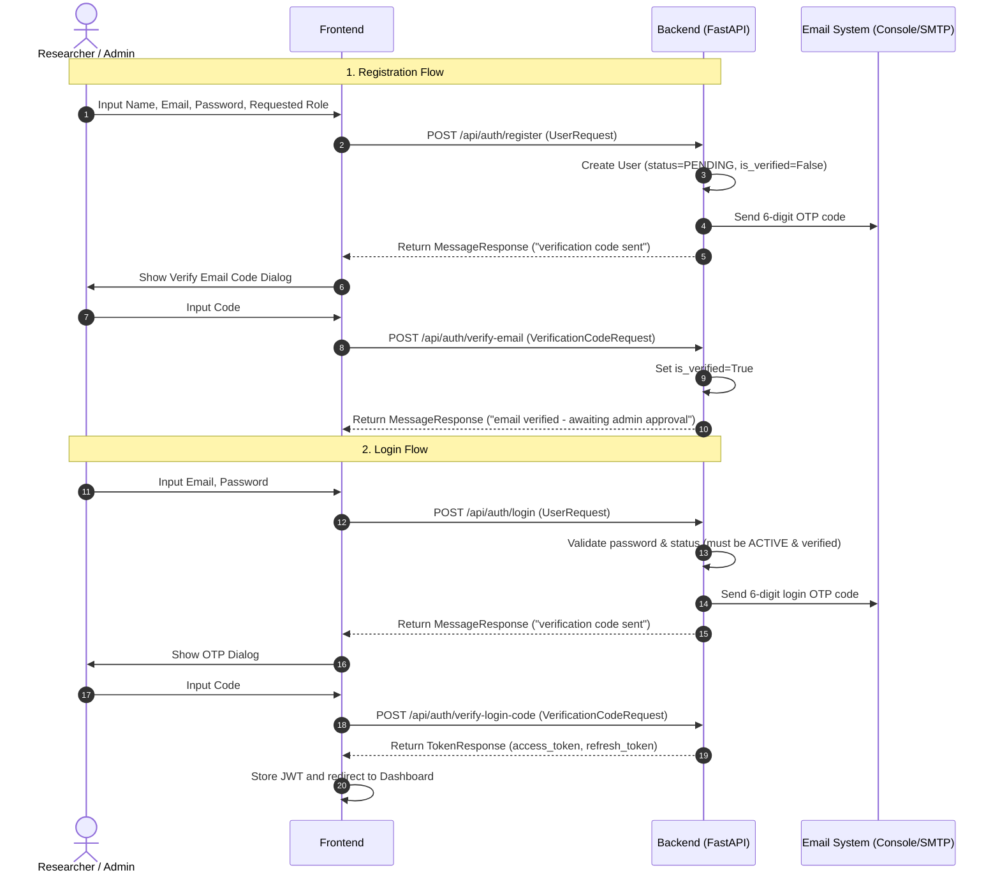
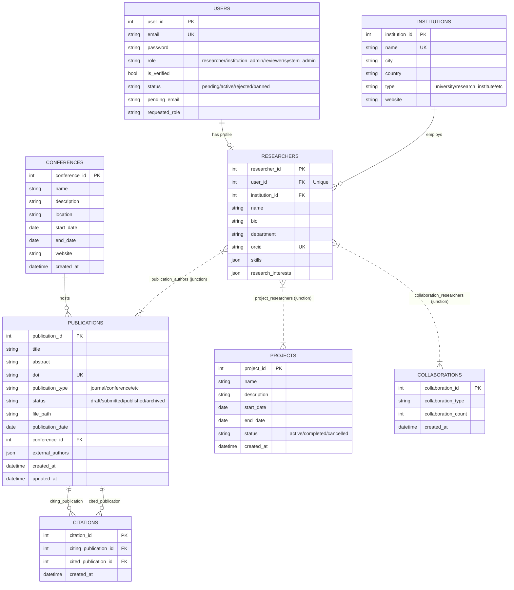

# Scientific Collaboration Network — Frontend API Mapping & Design Analysis

This document provides a comprehensive mapping of the backend APIs, roles, database entities, authentication flows, and frontend routing requirements for the **Scientific Collaboration Network**.

---

## 1. Authentication Flow

The backend employs a two-stage process for registration and login to ensure security and institutional domain verification.

### Key Rules
* **Institutional Domain Restriction**: Registration emails must belong to a recognized research domain (`is_research_email` check).
* **Double OTP verification**: Users must verify their email right after registration, and entering correct credentials during login triggers a second OTP.
* **Admin Approval**: After registering and verifying their email, a user remains in `PENDING` status. They cannot log in until a System Admin approves their account.

---

## 2. Role and Permission Matrix

Based on role dependencies in `deps.py`, the backend checks permissions for specific endpoints.

| Role | Description | Permissions & Privileges |
| :--- | :--- | :--- |
| **Researcher** (`researcher`) | General academic user | Create profile, view directory, manage own publications, upload files, manage own projects, log citations, view own dashboard. |
| **Reviewer** (`reviewer`) | Peer reviewer | All Researcher permissions, plus reviewer-specific routes if defined (currently shares researcher access but verified under role checks). |
| **Institution Admin** (`institution_admin`) | Admin for a specific university/lab | Manage institutional stats and view details (grouped under admin checks). |
| **System Admin** (`system_admin`) | Global platform administrator | Approve/reject users, ban users, change user roles, CRUD conferences, CRUD institutions, view system dashboard/stats, approve role change requests. |

---

## 3. Entity Relationships

---

## 4. API Endpoints & Frontend Mapping

| Backend Endpoint | Method | Purpose | Authentication | Allowed Roles | Request Body Schema | Response Schema | Frontend View | Frontend Service |
| :--- | :--- | :--- | :--- | :--- | :--- | :--- | :--- | :--- |
| `/api/auth/register` | POST | Register new user | None | All | `UserRequest` | `MessageResponse` | `/register` | `authService` |
| `/api/auth/verify-email` | POST | Verify email OTP | None | All | `VerificationCodeRequest` | `MessageResponse` | `/verify-email` | `authService` |
| `/api/auth/login` | POST | First phase login | None | All | `UserRequest` | `MessageResponse` | `/login` | `authService` |
| `/api/auth/verify-login-code` | POST | Second phase login OTP | None | All | `VerificationCodeRequest` | `TokenResponse` | `/verify-login` | `authService` |
| `/api/auth/refresh` | POST | Refresh Access Token | None | All | `RefreshRequest` | `TokenResponse` | Global Axios Interceptor | `authService` |
| `/api/auth/logout` | POST | Revoke refresh token | None | All | `RefreshRequest` | None (204) | Navigation Header | `authService` |
| `/api/auth/request-email-change` | POST | Start email change | CurrentUser | All | `EmailChangeRequest` | `MessageResponse` | `/settings` | `authService` |
| `/api/auth/verify-email-change` | POST | Confirm email change OTP | CurrentUser | All | `VerificationCodeRequest` | `MessageResponse` | `/settings` | `authService` |
| `/api/users/me` | GET | Fetch self user | CurrentUser | All | None | `UserResponse` | `/dashboard` / `/profile` | `userService` |
| `/api/users/me` | PATCH | Update self credentials | CurrentUser | All | `UserUpdateRequest` | `UserResponse` | `/settings` | `userService` |
| `/api/users/me` | DELETE | Delete self account | CurrentUser | All | None | None (204) | `/settings` | `userService` |
| `/api/users/me/request-role-change` | POST | Request new role | CurrentUser | All | `RoleChangeRequest` | `MessageResponse` | `/settings` | `userService` |
| `/api/users/pending` | GET | List pending approvals | AdminUser | `system_admin` | None | `list[UserResponse]` | `/admin/pending-users` | `adminService` |
| `/api/users/all-users` | GET | List all users | AdminUser | `system_admin` | None | `list[UserResponse]` | `/admin/users` | `adminService` |
| `/api/users/{user_id}/approve` | PATCH | Approve user account | AdminUser | `system_admin` | None | `UserResponse` | `/admin/pending-users` | `adminService` |
| `/api/users/{user_id}/reject` | PATCH | Reject user account | AdminUser | `system_admin` | None | `UserResponse` | `/admin/pending-users` | `adminService` |
| `/api/users/{user_id}/role` | PATCH | Force modify user role | AdminUser | `system_admin` | `UserRoleUpdateRequest` | `UserResponse` | `/admin/users` | `adminService` |
| `/api/users/{user_id}/ban` | PATCH | Ban a user | AdminUser | `system_admin` | None | `UserResponse` | `/admin/users` | `adminService` |
| `/api/users/{user_id}` | DELETE | Delete a user | AdminUser | `system_admin` | None | None (204) | `/admin/users` | `adminService` |
| `/api/users/role-change-requests` | GET | List role changes | AdminUser | `system_admin` | None | `list[UserResponse]` | `/admin/role-requests` | `adminService` |
| `/api/users/{user_id}/approve-role-change` | PATCH | Approve role request | AdminUser | `system_admin` | None | `UserResponse` | `/admin/role-requests` | `adminService` |
| `/api/researchers/` | POST | Create researcher profile | CurrentUser | All | `ResearcherRequest` | `ResearcherResponse` | `/profile/create` | `researcherService` |
| `/api/researchers/` | GET | Get all researchers | None | All | None | `list[ResearcherResponse]` | `/researchers` | `researcherService` |
| `/api/researchers/researcher_id` | GET | Get single researcher | None | All | None (query: `researcher_id`) | `ResearcherResponse` | `/researchers/:id` | `researcherService` |
| `/api/researchers/me` | PATCH | Update own profile | CurrentUser | All | `ResearcherUpdateRequest` | `ResearcherResponse` | `/profile/edit` | `researcherService` |
| `/api/researchers/me` | DELETE | Delete own profile | CurrentUser | All | None | None (204) | `/settings` | `researcherService` |
| `/api/publications/` | GET | List all publications | None | All | None | `list[PublicationResponse]` | `/publications` | `publicationService` |
| `/api/publications/my` | GET | Get own publications | CurrentResearcher | All | None | `list[PublicationResponse]` | `/publications` (My tab) | `publicationService` |
| `/api/publications/{publication_id}` | GET | Get publication detail | None | All | None | `PublicationResponse` | `/publications/:id` | `publicationService` |
| `/api/publications/` | POST | Create publication | CurrentResearcher | All | `PublicationRequest` | `PublicationResponse` | `/publications/new` | `publicationService` |
| `/api/publications/{publication_id}` | PATCH | Update publication | CurrentResearcher | All | `PublicationUpdateRequest` | `PublicationResponse` | `/publications/:id/edit` | `publicationService` |
| `/api/publications/{publication_id}` | DELETE | Delete publication | CurrentResearcher | All | None | None (204) | `/publications` | `publicationService` |
| `/api/publications/{publication_id}/upload` | POST | Upload PDF/Docx | CurrentResearcher | All | Multipart Form (`file`) | `PublicationResponse` | `/publications/:id` | `publicationService` |
| `/api/projects/` | GET | List all projects | None | All | None | `list[ProjectResponse]` | `/projects` | `projectService` |
| `/api/projects/my` | GET | Get own projects | CurrentResearcher | All | None | `list[ProjectResponse]` | `/projects` (My tab) | `projectService` |
| `/api/projects/{project_id}` | GET | Get project detail | None | All | None | `ProjectResponse` | `/projects/:id` | `projectService` |
| `/api/projects/` | POST | Create new project | CurrentResearcher | All | `ProjectRequest` | `ProjectResponse` | `/projects/new` | `projectService` |
| `/api/projects/{project_id}` | PATCH | Update project | CurrentResearcher | All | `ProjectUpdateRequest` | `ProjectResponse` | `/projects/:id/edit` | `projectService` |
| `/api/projects/{project_id}` | DELETE | Delete project | CurrentResearcher | All | None | None (204) | `/projects` | `projectService` |
| `/api/collaborations/` | GET | Get collaboration graph | None | All | None | `list[CollaborationResponse]` | `/collaborations` | `collaborationService` |
| `/api/collaborations/my` | GET | Get own collaborations | CurrentResearcher | All | None | `list[CollaborationResponse]` | `/collaborations` | `collaborationService` |
| `/api/collaborations/` | POST | Add collaboration edge | CurrentUser | All | `CollaborationRequest` | `CollaborationResponse` | `/collaborations` | `collaborationService` |
| `/api/collaborations/{collaboration_id}` | DELETE | Remove collaboration edge | CurrentUser | All | None | None (204) | `/collaborations` | `collaborationService` |
| `/api/conferences/` | GET | List conferences | None | All | None | `list[ConferenceResponse]` | `/conferences` | `conferenceService` |
| `/api/conferences/{conference_id}` | GET | Get conference detail | None | All | None | `ConferenceResponse` | `/conferences/:id` | `conferenceService` |
| `/api/conferences/` | POST | Create conference | AdminUser | `system_admin` | `ConferenceRequest` | `ConferenceResponse` | `/admin/conferences/new` | `conferenceService` |
| `/api/conferences/{conference_id}` | PATCH | Update conference | AdminUser | `system_admin` | `ConferenceUpdateRequest` | `ConferenceResponse` | `/admin/conferences/:id` | `conferenceService` |
| `/api/conferences/{conference_id}` | DELETE | Delete conference | AdminUser | `system_admin` | None | None (204) | `/admin/conferences` | `conferenceService` |
| `/api/citations/` | POST | Record citations | CurrentUser | All | `CitationRequest` | `list[CitationResponse]` | `/citations` | `citationService` |
| `/api/citations/by-publication/{pub_id}` | GET | Citations made by pub | None | All | None | `list[CitationResponse]` | `/publications/:id` | `citationService` |
| `/api/citations/cited-by/{pub_id}` | GET | Citations referencing pub | None | All | None | `list[CitationResponse]` | `/publications/:id` | `citationService` |
| `/api/citations/{citation_id}` | DELETE | Remove citation | CurrentUser | All | None | None (204) | `/citations` | `citationService` |
| `/api/dashboard/me` | GET | Fetch researcher stats | CurrentUser | All | None | `ResearcherDashboard` | `/dashboard` | `dashboardService` |
| `/api/dashboard/institution/{inst_id}` | GET | Fetch inst stats | AdminUser | `system_admin`, `institution_admin` | None | `InstitutionStats` | `/admin/institutions/:id` | `dashboardService` |
| `/api/dashboard/system` | GET | Fetch platform stats | AdminUser | `system_admin` | None | `SystemStats` | `/admin` | `dashboardService` |
| `/api/reports/publications/csv` | POST | Stream publication CSV | CurrentUser | All | `PublicationReportFilter` | Binary Stream (CSV) | `/reports` | `reportService` |
| `/api/reports/publications/json` | POST | Stream publication JSON | CurrentUser | All | `PublicationReportFilter` | Binary Stream (JSON) | `/reports` | `reportService` |
| `/api/reports/collaborations/csv` | POST | Stream collaboration CSV | CurrentUser | All | `CollaborationReportFilter` | Binary Stream (CSV) | `/reports` | `reportService` |
| `/api/institutions/` | GET | List institutions | None | All | None | `list[InstitutionResponse]` | `/admin/institutions` | `institutionService` |
| `/api/institutions/{institution_id}` | GET | Get institution details | None | All | None | `InstitutionResponse` | `/admin/institutions/:id` | `institutionService` |
| `/api/institutions/` | POST | Create institution | AdminUser | `system_admin` | `InstitutionRequest` | `InstitutionResponse` | `/admin/institutions` | `institutionService` |
| `/api/institutions/{institution_id}` | PATCH | Update institution | AdminUser | `system_admin` | `InstitutionUpdateRequest` | `InstitutionResponse` | `/admin/institutions` | `institutionService` |
| `/api/institutions/{institution_id}` | DELETE | Delete institution | AdminUser | `system_admin` | None | None (204) | `/admin/institutions` | `institutionService` |

---

## 5. Required Frontend Routes

### Public Routes
* `/` — Landing Page (academic presentation of metrics, discoverability, search).
* `/login` — Login credential entry page.
* `/register` — Account registration.
* `/verify-email` — Registration email OTP confirmation.
* `/verify-login` — Security OTP entry after password verification.

### Protected General Routes (All roles with verified and active account status)
* `/dashboard` — Researcher dashboard (stats cards, publications trends, active project lists).
* `/profile` — Self academic profile view.
* `/profile/edit` — Edit self profile (orcid, department, skills, research interests).
* `/profile/create` — Prompted if the registered user has no researcher profile yet.
* `/researchers` — Directory of all researchers (search & filter by skills, department, name).
* `/researchers/:id` — Detail view of other researcher.
* `/publications` — Search publications, my publications tab, filter by type/status.
* `/publications/new` — Upload/record new publication.
* `/publications/:id` — Details, PDF download, reference list, citing documents.
* `/publications/:id/edit` — Update abstract, authors, date, DOI, conference association.
* `/projects` — Project explorer.
* `/projects/new` — Create research projects.
* `/projects/:id` — Project details, member listing, timeline.
* `/collaborations` — Visual collaboration graph + list view (alternative for mobile).
* `/conferences` — Explore conferences & locations.
* `/citations` — Interactive citation analytics & listing.
* `/reports` — Export PDF/CSV summaries based on date, type, status, or collaboration edge.
* `/settings` — Self security management (change email, change password, request role upgrades).

### Protected Admin Routes (Requires role `system_admin`)
* `/admin` — System analytics dashboard.
* `/admin/users` — User management directory (bans, deletions, role updates).
* `/admin/pending-users` — Quick list of users awaiting approval.
* `/admin/institutions` — Add, update, delete institutions.
* `/admin/conferences` — Administer conferences list.
* `/admin/role-requests` — Manage role request queue.
